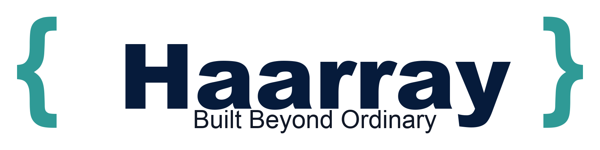

  

## Haarray

Haarray is a product organization built around disciplined, useful, long-term software.

The name is inspired by Hari, the founder's grandfather. The company name is **Haarray**.

### First product: Harilog

**Harilog** is a personal finance and life logging system.

> Log money. Log life.

Harilog helps people record:

- expenses and income
- accounts and wallets
- categories and tags
- journals and reflections
- receipts and attachments
- portfolio and assets
- monthly summaries and reports

The first version is a Laravel web app using Blade, Bootstrap, jQuery, Sanctum-ready APIs, and a clean backend designed for future mobile use.

### Future products

- **HariCMS** - future multi-project CMS / website engine.
- More Haarray/Hari family products after Harilog is usable.

### Product principles

- Build real products, not demos.
- Keep code Laravel-native and maintainable.
- Prefer small working vertical slices.
- Avoid over-engineering.
- Make software that remembers useful things.
